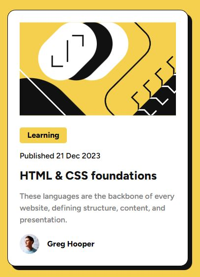

# Frontend Mentor - Blog preview card solution

This is a solution to the [Blog preview card challenge on Frontend Mentor](https://www.frontendmentor.io/challenges/blog-preview-card-ckPaj01IcS). Frontend Mentor challenges help you improve your coding skills by building realistic projects. 

## Table of contents

- [Overview](#overview)
  - [The challenge](#the-challenge)
  - [Screenshot](#screenshot)
  - [Links](#links)
- [My process](#my-process)
  - [Built with](#built-with)
  - [What I learned](#what-i-learned)
  - [Continued development](#continued-development)
  - [Useful resources](#useful-resources)
- [Author](#author)

## Overview

### The challenge

Users should be able to:

- See hover and focus states for all interactive elements on the page

### Screenshot

### Links

- Solution URL: [Add solution URL here](https://github.com/UnknownBuilder/FEmentor_blog_preview-card)
- Live Site URL: [Add live site URL here](https://unknownbuilder.github.io/FEmentor_blog_preview-card/)

## My process

### Built with

- CSS Flexbox
- CSS Grid

**Note: These are just examples. Delete this note and replace the list above with your own choices**

### What I learned

This was the first project that I used CSS Grid. 

I will admit that I used CSS Grid with CSS Flexbox. I did this because I've always heard from the internet that Grid is great for outlining your page and flexbox is great doing everything else. I took this a tried it out coming from a place were I've only used flexbox to do everything. I got say, they're right. It was significantly easier to outline the webpage using Grid. And by easier I mean, it took less code.  

### Continued development

I'm going to expand my skills in Grid going forward. Perhaps the next project I'm going to use nothing but Grid to see how each technology does the job. 

### Useful resources

- [Fireship IO](https://www.youtube.com/watch?v=uuOXPWCh-6o&ab_channel=Fireship) - Very quick explanation of Grid and how to use it.
- [Getting Started with Grid](https://www.youtube.com/watch?v=8QSqwbSztnA&ab_channel=KevinPowell) - The master teacher on everything and anything CSS on YouTube. He did a great job explaining Grid. 
- [Flexbox or Grid](https://www.youtube.com/watch?v=8QSqwbSztnA&ab_channel=KevinPowell) - Kevin Powell explanation on when you should use Grid and when to use Flexbox.
- [Learn Grid the Easy Way](https://www.youtube.com/watch?v=rg7Fvvl3taU&t=978s&ab_channel=KevinPowell) - Kevin Powell doing his thing explaning Grid in a different way. 

## Author

- Github - [Developing Hephaestus](https://github.com/UnknownBuilder)
- Frontend Mentor - [@UnknownBuilder](https://www.frontendmentor.io/profile/UnknownBuilder)

## Acknowledgments

My hats off to Kevin Powell for his great contributions to the web development community. His youtube videos are gold!

